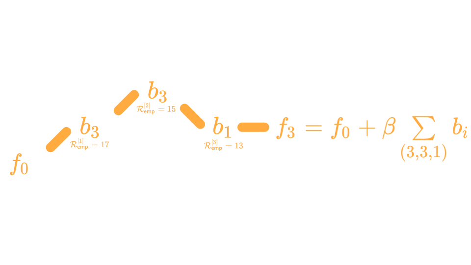

```{r, include=FALSE}
knitr::opts_chunk$set(collapse = TRUE, fig.align="center", out.width="70%")

# Load compboost developer version:
devtools::load_all("../compboost")
library(ggthemes)
library(ggplot2)
library(dplyr)

n_sim = 200

set.seed(314159)

offset = 0

country = sample(x = c("Austria", "Seychelles", "Germany", "Poland", "Ireland"), 
  size = n_sim, replace = TRUE)

country_biases = c(Austria = 104, Seychelles = 111, Germany = 104, Poland = 98, 
  Ireland = 97) - 104

age = sample(x = 16:70, size = n_sim, replace = TRUE)
contr_age = (10 - 0.1 * (age - 16)^2 + 0.002 * (age - 16)^3) / 7

gender = sample(x = c("m", "f"), size = n_sim, replace = TRUE)
gender_biases = c(m = 5, f = -2)

mw_consumption = offset + country_biases[country] + gender_biases[gender] + contr_age + rnorm(n = n_sim, mean = 0, sd = 2)
mw_consumption = ifelse(mw_consumption < 0, 0, mw_consumption)

mulled_wine_data = data.frame(
  mw_consumption = mw_consumption,
  gender = gender,
  country = country,
  age = age,
  weight = runif(n = n_sim, min = 60, max = 120),
  height = runif(n = n_sim, min = 156, max = 204)
)

for (i in 1:200) {
  set.seed(i * 3)
  mulled_wine_data[[paste0("noise", i)]] = runif(n = n_sim)
}
```


# Use-Case

## 

-   We are owners of a small stand at the Christmas market where we sell mulled wine. 

-   Since we are very interested in the health of our customers, we only sell to customers who we expect to drink less than 15 litres per year.

-   To estimate how much a customer will drink, we have collected data from 200 customers in recent years.

-   These data include mulled wine consumption, age, sex, country of origin, weight, body size, and 200 characteristics (that have absolutely no influence).

##

```{r, echo=FALSE}
knitr::kable(mulled_wine_data[1:10, 1:7])
```

##

With these data we want to answer the following questions:

-   Which characteristics of the customer are important to be able to guess the consumption?
-   What does the effect of important features look like?
-   How does the model behave on unseen data?

##

**What can we do to respond to all the questions?**

# Component-Wise Boosting

## Component ... what?

<iframe src="https://giphy.com/embed/pPhyAv5t9V8djyRFJH" width="720" height="525" frameBorder="0" class="giphy-embed" allowFullScreen></iframe><p></p>

## The Idea Behind Component-Wise Boosting



## Why Component-Wise Boosting?

-   Inherent (unbiased) feature selection.
    
-   Resulting model is sparse since important effects are selected first and therefore it is able to learn in high-dimensional feature spaces ($p \gg n$).
    
-   Parameters are updated iteratively. Therefore, the whole trace of how the model evolves is available.  

## About `compboost`

The `compboost` package is a fast and flexible framework for model-based boosting completely written in `C++`:

-   With `mboost` as standard, we want to keep the modular principle of defining custom base-learner and losses.

-   Completely written in `C++` and exposed by `Rcpp` to obtain high performance and full memory control.

-   `R` API is written in `R6` to provide convenient wrapper.

-   Major parts of the `compboost` functionality are unit tested against `mboost` to ensure correctness.

# Use-Case

## `compboost`

```{r cars, echo = TRUE}
cboost = boostSplines(data = mulled_wine_data, target = "mw_consumption", 
  loss = LossQuadratic$new(), learning.rate = 0.005, iterations = 3000, 
  trace = 600)
```

## Effect Visualization

```{r, eval=FALSE}
cboost$plot("age_spline", iters = c(200, 500, 1000, 3000))
```
```{r, echo=FALSE}
cboost$plot("age_spline", iters = c(200, 500, 1000, 3000)) +
  theme_tufte() + ggplot2::scale_color_brewer(palette = "Set1")
```

## Early Stopping

```{r, echo=-1}
set.seed(3141)
n_data = nrow(mulled_wine_data)
idx_train = sample(x = seq_len(n_data), size = n_data * 0.75)
idx_test = setdiff(x = seq_len(n_data), idx_train)
```

## Early Stopping

```{r}
target = "mw_consumption"

cboost = Compboost$new(data = mulled_wine_data[idx_train,], 
  target = target, loss = LossQuadratic$new(), learning.rate = 0.005)

for (feature_name in setdiff(names(mulled_wine_data), target)) {
  if (feature_name %in% c("gender", "country")) {
    cboost$addBaselearner(feature = feature_name, id = "category", 
      bl.factory = BaselearnerPolynomial, degree = 1, intercept = FALSE)
  } else {
    cboost$addBaselearner(feature = feature_name, id = "spline", 
      bl.factory = BaselearnerPSpline, degree = 3, n.knots = 10)
  }
}
```

## Early Stopping

```{r, warning=FALSE}
oob_data = cboost$prepareData(mulled_wine_data[idx_test,])
```

## Early Stopping

```{r, warning=FALSE}
cboost$addLogger(logger = LoggerOobRisk, use.as.stopper = FALSE, 
  logger.id = "oob_logger", used.loss = LossQuadratic$new(), 
  eps.for.break = 0, oob.data = oob_data, 
  oob.response = mulled_wine_data$mw_consumption[idx_test])

cboost$train(3000, trace = 1500)

inbag_trace = cboost$getInbagRisk()[-1]
logger_data = cboost$getLoggerData()

risk_data = data.frame(
  risk = c(inbag_trace, logger_data[["oob_logger"]]),
  type = rep(c("inbag", "oob"), each = length(inbag_trace)),
  iter = rep(seq_along(inbag_trace), times = 2)
)
```

## Early Stopping

```{r}
ggplot(data = risk_data, aes(x = iter, y = risk, color = type)) + 
  geom_line() + theme_tufte() + scale_color_brewer(palette = "Set1")
```


## Early Stopping

```{r}
cboost$train(980)
```

## Feature Importance

```{r, echo=FALSE}
oob_trace = c(
  mean(0.5 * (mulled_wine_data$mw_consumption[idx_test] - cboost$model$getOffset())^2),
  cboost$getLoggerData()[["oob_logger"]]
)

# feature importance:
oob_risk_reduction = -diff(oob_trace)
fitted_base_learner = cboost$getSelectedBaselearner()

vip_oob = aggregate(oob_risk_reduction, by = list(fitted_base_learner), FUN = mean)
vip_oob_order = order(vip_oob[,2], decreasing = TRUE)
top15_oob = vip_oob[vip_oob_order,]
top15_oob$type = "oob"

colnames(top15_oob) = c("baselearner", "risk_reduction", "type")

# data_vip[["baselearner"]] = factor(data_vip[["baselearner"]], levels = risk_bl)

top15_oob %>% 
  ggplot(aes(reorder(baselearner, -risk_reduction), risk_reduction, fill = type)) + 
    geom_bar(stat = "identity", position = position_dodge(), show.legend = FALSE) + 
    scale_fill_brewer(palette = "Set1") +
    theme_tufte() +
    theme(axis.text.x = element_text(angle = 90, hjust = 1)) +
    xlab("Base-Leearner") + ylab("Mean Out of Bag\nRisk Reduction") +
    guides(fill = guide_legend(title = "Risk Type"))
```

## Using Custom Losses

```{r}
lossPoi = function (truth, pred) {
  return (-log(exp(pred)^truth * exp(-exp(pred)) / gamma(truth + 1)))
}
gradPoi = function (truth, pred) {
  return (exp(pred) - truth)
}
constInitPoi = function (truth) {
  return (log(mean.default(truth)))
}
# Define custom loss:
my_poisson_loss = LossCustom$new(lossPoi, gradPoi, constInitPoi)
```

## Using Custom Losses

```{r}
cboost = boostSplines(data = mulled_wine_data, target = "mw_consumption", 
  optimizer = OptimizerCoordinateDescent$new(), loss = my_poisson_loss, 
  learning.rate = 0.005, iterations = 3000, trace = 600, n.knots = 10, 
  degree = 3)
```

# From C++ to R

## Rcpp

-   Conversion between `R` and `C++` data structures, such as vectors, matrices, or even whole classes
-   Seamless integration of [Armadillo](http://arma.sourceforge.net/) for linear algebra
-   Complicated stuff like compilation, or again, the conversion between `R` and `C++` are handled automatically

## C++ to R Wrap Up

## Problems When Using C++

-   Save object is not possible at the moment <!-- serialization is not done automatically-->
-   Memory managing is not easy $\Rightarrow$ Segmentation folds may happen
-   

# What Happens Next?

## 

-   Better selection process of base-learner
-   Fasten the training by parallel computations
-   More extensive functionality:
    -   Functional data structures and loss functions
    -   Unbiased feature selection
    -   Effect decomposition into constant, linear, and non-linear and selection


# Thanks for your attention!

## Credits

- [**revealjs**](https://revealjs.com/)
- [**Font-Awesome:**](https://www.google.com)
- [**rmarkdown**](https://rmarkdown.rstudio.com/)
- [**revealjs (R Package)**](https://cran.r-project.org/web/packages/revealjs/index.html)
- [**Google Fonts**](https://fonts.google.com/)


