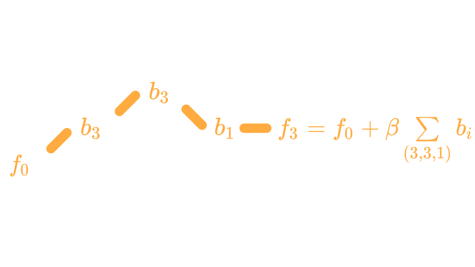
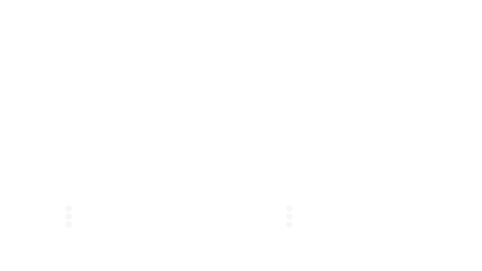

```{r, include=FALSE}
knitr::opts_chunk$set(collapse = TRUE, fig.align = "center", out.width = "50%")

# Load compboost developer version:
devtools::load_all("../compboost")
library(ggthemes)
library(ggplot2)
library(dplyr)

n_sim = 200

set.seed(314159)

offset = 14

country = sample(x = c("Austria", "Seychelles", "Germany", "Poland", "Ireland"), 
  size = n_sim, replace = TRUE)

country_biases = c(Austria = 104, Seychelles = 111, Germany = 104, Poland = 98, 
  Ireland = 97) - 104

age = sample(x = 16:70, size = n_sim, replace = TRUE)
contr_age = (10 - 0.1 * (age - 16)^2 + 0.002 * (age - 16)^3) / 5

gender = sample(x = c("m", "f"), size = n_sim, replace = TRUE)
gender_biases = c(m = 5, f = -2)

mw_consumption = offset + country_biases[country] + gender_biases[gender] + contr_age + rnorm(n = n_sim, mean = 0, sd = 2)
mw_consumption = ifelse(mw_consumption < 0, 0, mw_consumption) / 2

mulled_wine_data = data.frame(
  mw_consumption = round(mw_consumption / 0.3) * 0.3,
  mw_consumption_cups = round(mw_consumption / 0.3),
  gender = gender,
  country = country,
  age = age,
  weight = runif(n = n_sim, min = 60, max = 120),
  height = runif(n = n_sim, min = 156, max = 204)
)

for (i in 1:200) {
  set.seed(i * 3)
  mulled_wine_data[[paste0("app_usage", i)]] = runif(n = n_sim)
}
```


# Use-Case

## 

-   We own a small booth at the Christmas market that sells mulled wine. 

-   As we are very interested in our customers' health, we only sell to customers who we expect to drink less than 15 liters per season.

-   To estimate how much a customer drinks, we have collected data from 200 customers in recent years.

-   These data include mulled wine consumption (in liter and cups), age, sex, country of origin, weight, body size, and 200 characteristics gained from app usage (that have absolutely no influence).

##

```{r, echo=FALSE}
knitr::kable(mulled_wine_data[1:10, 1:8])
```

##

With these data we want to answer the following questions:

-   Which of the customers' characteristics are important to be able to determine the consumption?
-   How does the effect of important features look like?
-   How does the model behave on unseen data?

##

<center>
**What can we do to answer all the questions?**
</center>

##

<center>
**What can we do to answer all the questions?**
</center>

- Fit a linear model?
- Fit a linear model on each feature and build the ensemble?
- Fit a regularized linear model?
- Train a random forest?

##

<center>
**What can we do to answer all the questions?**
</center>

- Fit a linear model? \
  $\rightarrow$ Not possible since $p > n$.

- Fit a linear model on each feature and build the ensemble? \
  $\rightarrow$ Possible, but how should we determine important effects?

- Fit a regularized linear model? \
  $\rightarrow$ Possible, but with the linear model we get just linear effects.

- Train a random forest? \
  $\rightarrow$ Possible, but we want to interpret the effects.


# Component-Wise Boosting

## The Idea of Component-Wise Boosting

```{r, echo=FALSE, out.width="80%"}

```

## Why Component-Wise Boosting?

-   Inherent (unbiased) feature selection.
    
-   Resulting model is sparse since important effects are selected first and therefore it is able to learn in high-dimensional feature spaces ($p \gg n$).
    
-   Parameters are updated iteratively. Therefore, the whole trace of how the model evolves is available.  

## About `compboost`

The `compboost` package is a fast and flexible framework for model-based boosting completely written in `C++`:

-   With `mboost` as standard, we want to keep the modular principle of defining custom base-learner and losses.

-   Completely written in `C++` and exposed by `Rcpp` to obtain high performance and full memory control.

-   `R` API is written in `R6` to provide convenient wrapper.

-   Major parts of the `compboost` functionality are unit tested against `mboost` to ensure correctness.

# Applying `compboost` to the Use-Case

## Quick Start With Wrapper Functions

```{r cars, echo = TRUE}
cboost = boostSplines(data = mulled_wine_data[,-2], 
  target = "mw_consumption", loss = LossQuadratic$new(), 
  learning.rate = 0.005, iterations = 6000, trace = 600)
```

## Effect Visualization

```{r, eval=FALSE}
cboost$plot("age_spline", iters = c(200, 500, 1000, 3000))
```
```{r, echo=FALSE}
cboost$plot("age_spline", iters = c(200, 500, 1000, 3000)) +
  theme_tufte() + ggplot2::scale_color_brewer(palette = "Set1")
```

## Inbag and OOB Behavior

To get an idea, how the model behaves on unseen data we use 75 % as training data and the other 25 % of the data to calculate the out of bag (OOB) risk:

```{r, echo=-1}
set.seed(3141)
n_data = nrow(mulled_wine_data)
idx_train = sample(x = seq_len(n_data), size = n_data * 0.75)
idx_test = setdiff(x = seq_len(n_data), idx_train)
```

## Define Model and Base-Learner the "Object-Oriented Style"

```{r}
cboost = Compboost$new(data = mulled_wine_data[idx_train,-2], 
  target = "mw_consumption", loss = LossQuadratic$new(), 
  learning.rate = 0.005)

target_vars = c("mw_consumption", "mw_consumption_cups")

for (feature_name in setdiff(names(mulled_wine_data), target_vars)) {
  if (feature_name %in% c("gender", "country")) {
    cboost$addBaselearner(feature = feature_name, id = "category", 
      bl.factory = BaselearnerPolynomial, intercept = FALSE)
  } else {
    cboost$addBaselearner(feature = feature_name, id = "spline", 
      bl.factory = BaselearnerPSpline, degree = 3, n.knots = 10)
  }
}
```

## OOB Data

To track the OOB risk we have to prepare the new data so that `compboost` knows the new data sources: 

```{r, warning=FALSE}
oob_data = cboost$prepareData(mulled_wine_data[idx_test,])
oob_response = mulled_wine_data$mw_consumption[idx_test]
```

## Define Logger

```{r, warning=FALSE}
cboost$addLogger(logger = LoggerOobRisk, logger.id = "oob_risk",
  used.loss = LossQuadratic$new(), eps.for.break = 0,
  oob.data = oob_data, oob.response = oob_response)

cboost$addLogger(logger = LoggerTime, logger.id = "microseconds",
  max.time = 0, time.unit = "microseconds")

cboost$train(6000, trace = 1500)
```


## Extract Inbag and OOB Data

```{r}
inbag_trace = cboost$getInbagRisk()
head(inbag_trace)

logger_data = cboost$getLoggerData()
head(logger_data)
```


## Visualization of Inbag and OOB Risk

```{r, eval=FALSE}
oob_trace = logger_data[["oob_risk"]]

risk_data = data.frame(
  risk = c(inbag_trace, oob_trace),
  type = rep(c("inbag", "oob"), times = c(length(inbag_trace), 
    length(oob_trace))),
  iter = c(seq_along(inbag_trace), seq_along(oob_trace))
)
ggplot(risk_data, aes(x = iter, y = risk, color = type)) + geom_line()
```
```{r, fig.height=3, fig.width=4, out.width="45%", echo=FALSE}
oob_trace = logger_data[["oob_risk"]]

risk_data = data.frame(
  risk = c(inbag_trace, oob_trace),
  type = rep(c("inbag", "oob"), times = c(length(inbag_trace), 
    length(oob_trace))),
  iter = c(seq_along(inbag_trace), seq_along(oob_trace))
)
ggplot(risk_data, aes(x = iter, y = risk, color = type)) + 
  geom_line(size = 1.1) + theme_tufte() + scale_color_brewer(palette = "Set1") + 
  xlab("Iteration") + ylab("Risk") + labs(color = "")
```


## Set Model to a Specific Iteration

```{r}
cboost$train(2200)
cboost
```

## Feature Importance

```{r, eval=FALSE}
cboost$plotFeatureImportance(num.feat = 15L)
```
```{r, echo=FALSE}
cboost$plotFeatureImportance(num.feat = 15L) + theme_tufte()
```
<!-- ## Retrain the Model

```{r}
cboost$train(10000)
```
 -->

## Using Custom Losses - Defining a Loss

As customers do not buy the wine in liters but per cup, it might be better to use a Poisson loss to take the counting data into account. For that reason we define a custom loss:

```{r}
lossPoi = function (truth, pred) {
  return (-log(exp(pred)^truth * exp(-exp(pred)) / gamma(truth + 1)))
}
gradPoi = function (truth, pred) {
  return (exp(pred) - truth)
}
constInitPoi = function (truth) {
  return (log(mean.default(truth)))
}
# Define custom loss:
my_custom_loss = LossCustom$new(lossPoi, gradPoi, constInitPoi)
```

## Using Custom Losses - Using the Loss

```{r}
cboost = boostSplines(data = mulled_wine_data[,-1], 
  target = "mw_consumption_cups", loss = my_custom_loss,
  learning.rate = 0.005, iterations = 500, trace = 100, 
  n.knots = 10, degree = 3)
```

## Further Functionalities

-   Each logger can also be used as stopper, therefore we can use them for early stopping

-   In combination with the custom loss, we can use the OOB logger to track performance measures like the AUC (in binary classification)

-   Losses and base-learner can also be directly extended using `C++` (see `getCustomCppExample()`)

# From C++ to R

## Rcpp

-   Automated conversion between `R` and `C++` data structures, such as vectors, matrices, or even whole classes
-   Seamless integration of [Armadillo](http://arma.sourceforge.net/) for linear algebra
-   Complicated stuff like compilation, or again, the conversion between `R` and `C++` are handled automatically

## C++ to R Wrap Up of `compboost`



## Challenges When Using C++ and Rcpp

-   Saving object is not possible at the moment <!-- serialization is not done automatically-->
-   Memory managing is not easy $\Rightarrow$ Segmentation folds or memory leaks may happen
-   Exported API of classes is not very informative
-   Debugging of `C++` from `R` can be very annoying and time-consuming

# What's Next?

## 

-   Better selection process of base-learner
-   Speed up the training by parallel computations
-   Greater functionality:
    -   Functional data structures and loss functions
    -   Unbiased feature selection
    -   Effect decomposition into constant, linear, and non-linear


# Thanks for your attention!

## 

<center>
[](https://travis-ci.org/schalkdaniel/compboost) [](https://ci.appveyor.com/project/schalkdaniel/compboost) [](https://coveralls.io/github/schalkdaniel/compboost?branch=master) [](#license) [](https://cran.r-project.org/package=compboost) [](http://joss.theoj.org/papers/94cfdbbfdfc8796c5bdb1a74ee59fcda)
</center>

**Actively developed on GitHub:**
 
<p><center>https://github.com/schalkdaniel/compboost</center></p>

**Project page:**

<p><center>https://compboost.org/</center></p>

## Credits

Slides were created with:

- [**revealjs**](https://revealjs.com/)
- [**Font-Awesome:**](https://www.google.com)
- [**rmarkdown**](https://rmarkdown.rstudio.com/)
- [**revealjs (R Package)**](https://cran.r-project.org/web/packages/revealjs/index.html)
- [**Google Fonts**](https://fonts.google.com/)


